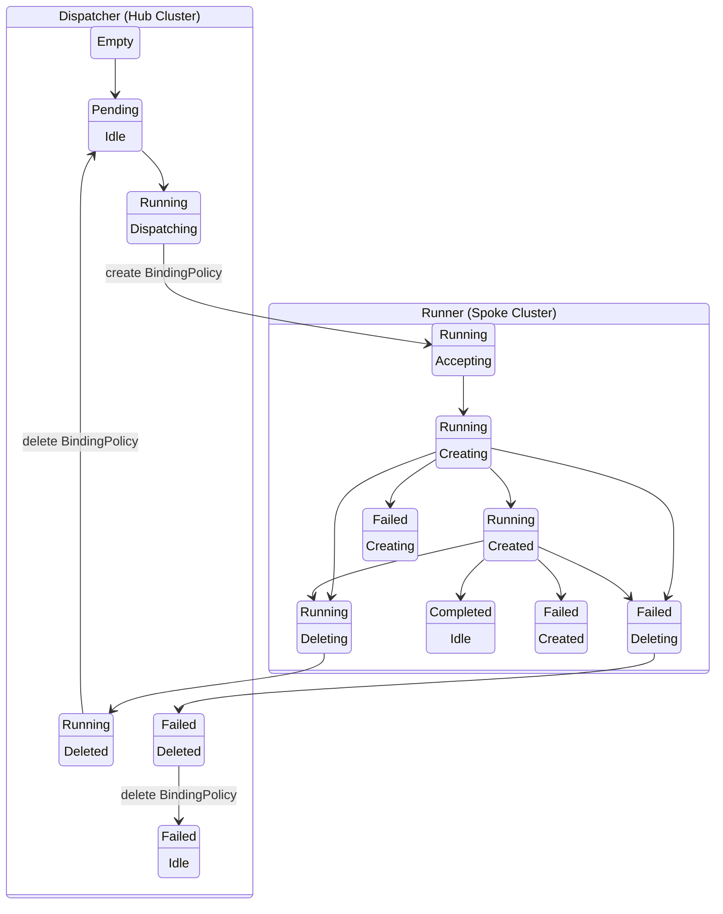

# AppWrapper State Diagram (Split Controller View)
During its lifetime an AppWrapper instance will transition between a number of states.
As is typical in Kubernetes resources, the current state of an AppWrapper is encoded by the
values stored in multiple fields of its Status.

The state diagram below depicts these transitions and the division of
responsibility between our two controllers: the Dispatcher and Runner.
The placement of each box indicates which controller is responsible
for reconciling AppWrappers in that state and determining when its
Status should be updated to initiated a transition to another state.
The first row in each box indicates the `AppWrapperState` and the
second indicates the `AppWrapperStep`.

