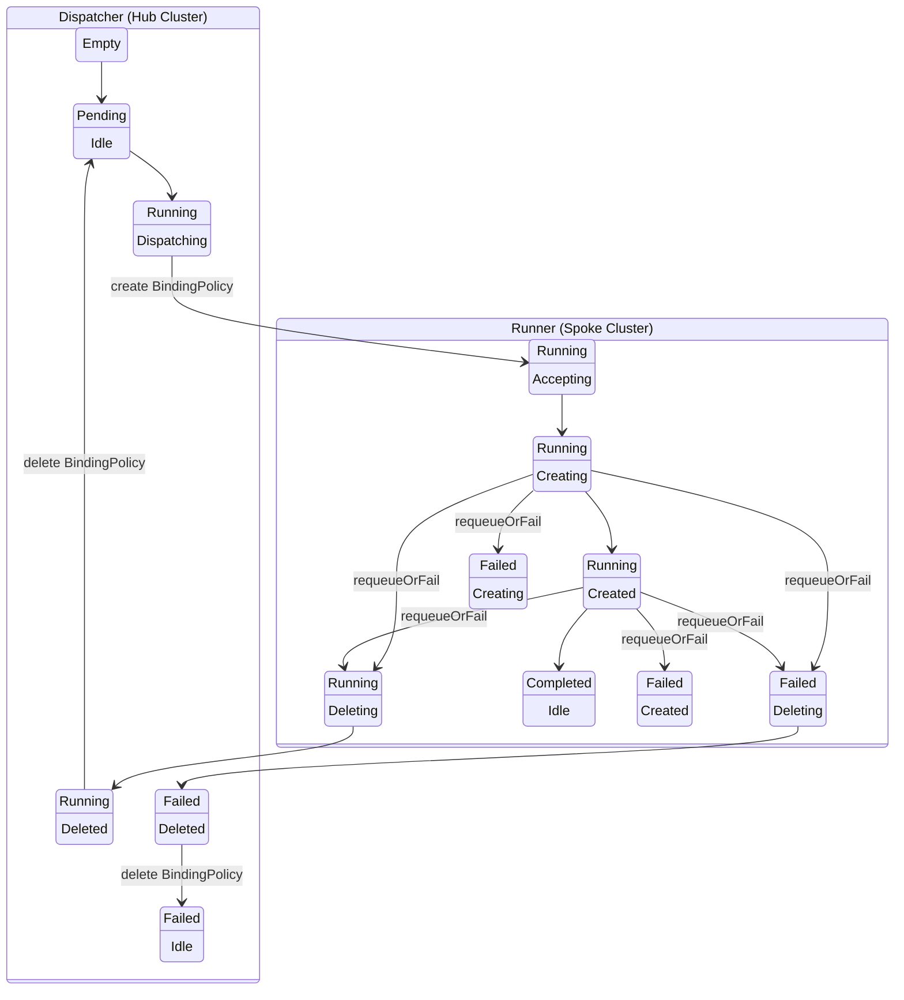

# AppWrapper State Diagram (Split Controller View)
The following state diagram describes the transitions between the states of an AppWrapper
focusing on the division of the states handled by the Dispatcher and Runner.
The placement of the box indicates which controller is responsible for handling that
state and initiating the transition to the next state.
The first row of each state indicates the `AppWrapperState` and the second indicates the `AppWrapperStep`.

