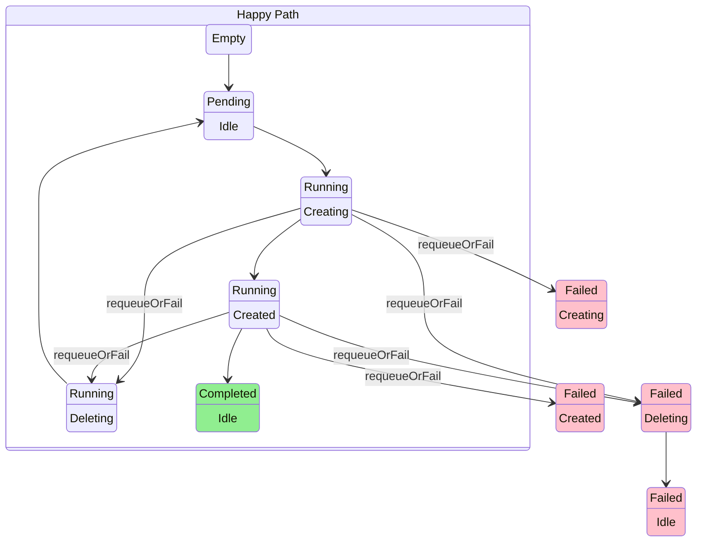

# AppWrapper State Diagram
The following state diagram describes the transitions between the states of an AppWrapper.
The first row of each state indicates the `AppWrapperState` and the second indicates the `AppWrapperStep`.

